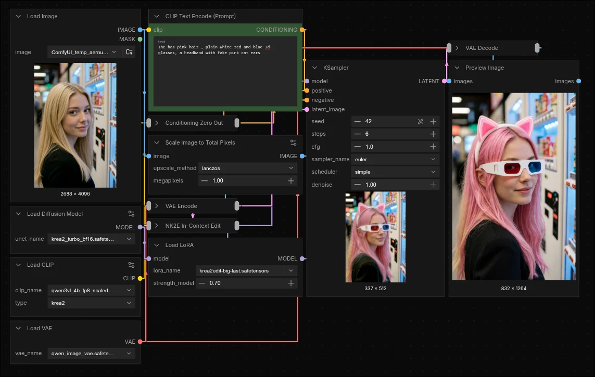

# ComfyUI-NK2E

> Nynxz's Krea 2 Edit

> [!WARNING]
> Experimental and unofficial. Results are rough and inconsistent, and vary a lot by
> edit type. Not affiliated with or endorsed by Krea.

In-context image editing for Krea 2 in ComfyUI. Give it a source image and a text
instruction (like "give her pink hair" or "add sunglasses") and it edits the image,
using an NK2E edit LoRA.




## Install

```
cd ComfyUI/custom_nodes
git clone https://github.com/nynxz/ComfyUI-NK2E
```
Download Models from [NK2E Hugging Face](https://huggingface.co/nynxz/NK2E/tree/main/comfy)

## Use

Drag [`workflow.json`](.github/assets/workflow.json) into ComfyUI to load the full graph.
Set the NK2E LoRA, load your source image, type the instruction, and run. Strength ~0.7,
denoise 1.0.

## Links

- Krea 2 Models: https://huggingface.co/Comfy-Org/Krea-2
- NK2E LoRAs: https://huggingface.co/nynxz/NK2E
- Training Scripts: https://github.com/nynxz/NK2E

## License

Krea 2 Community License. Not an official Krea project.
